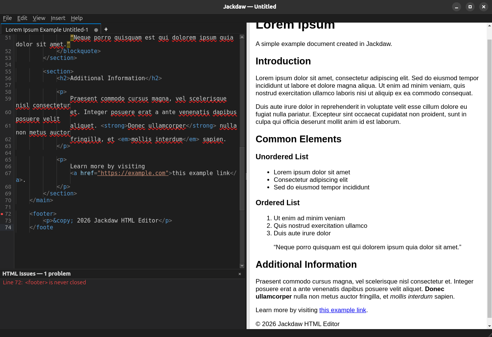

# Jackdaw

A lightweight, VS Code-inspired HTML editor with live preview, built with PyQt6.

---

## Why Jackdaw

I was using VS Code for editing knowledge-base article HTML, mainly for its live preview, but the surrounding complexity kept getting in the way — unexpected prompts, panels opening on their own, and the color theme resetting itself. None of it was related to the actual task. I wanted a focused HTML editor with live preview and only the tools I needed for the job.

Jackdaw started around that one core feature — a live split preview with synchronized scrolling and click navigation between rendered output and source. From there it grew into a full editor built around my daily workflow: HTML tag validation, spell check with a personal dictionary, a snippet system, and more.



---

## Features

- Live split preview with scroll and click sync
- Syntax highlighting with color swatches and URL underlining
- HTML tag validation with inline gutter markers
- Spell check with personal dictionary (bundled in Flatpak)
- Snippet system with tabstop expansion (`$1`, `$2`, mirrored stops)
- Find bar and Find & Replace (Firefox-style, docked)
- Multi-tab editing with session restore and crash recovery
- Rich copy — paste into Google Docs with syntax colors
- Tab/Shift+Tab indent (4 spaces) with indent guides and dots
- Tag completion modes: Manual, Smart (`</` completes), Auto (pairs on `>`)
- Dark and light themes

---

## Install

**Flatpak (recommended):**

Prerequisites — install Flatpak if you don't already have it:

```bash
# Debian/Ubuntu
sudo apt install flatpak flatpak-builder
# Fedora
sudo dnf install flatpak flatpak-builder
# Arch
sudo pacman -S flatpak flatpak-builder
```

(Other distros: see the [official Flatpak setup guide](https://flatpak.org/setup/).)

Add the Flathub remote and install the KDE 6.9 SDK/Platform:

```bash
flatpak remote-add --user --if-not-exists flathub https://flathub.org/repo/flathub.flatpakrepo
flatpak install --user flathub org.kde.Sdk//6.9 org.kde.Platform//6.9 com.riverbankcomputing.PyQt.BaseApp//6.9
```

Build and run:

```bash
git clone https://github.com/dposto/jackdaw.git
cd jackdaw
flatpak-builder --user --install --force-clean build-dir io.github.dposto.Jackdaw.json
flatpak run io.github.dposto.Jackdaw
```

**Run directly:**

```bash
git clone https://github.com/dposto/jackdaw.git
cd jackdaw
python3 jackdaw.py
```

Requires `python3-pyqt6` and `python3-pyqt6-webengine`.

**Optional (spell check, non-Flatpak only):**

```bash
# Debian/Ubuntu
sudo apt install python3-enchant aspell-en
# Fedora
sudo dnf install python3-enchant aspell-en
# Arch
sudo pacman -S python-pyenchant aspell aspell-en
```

Spell check is bundled automatically in the Flatpak build.

---

## Snippets

Snippets are stored in the app config folder and can be
imported/exported via **Insert → Manage Snippets…** for team sharing.

Body syntax:
- `$1`, `$2` — tabstops; Tab advances between them
- Same number (`$1 … $1`) — mirrored; typed text copies to both on Tab
- `$0` — final cursor position
- `|` — legacy single-cursor marker (still supported)

---

## License

GPL-3.0 — see [LICENSE](LICENSE)
See [THIRD_PARTY_LICENSES.md](THIRD_PARTY_LICENSES.md) for dependency license details.

---

## Credits

Built with:
- [PyQt6](https://riverbankcomputing.com/software/pyqt/) — Riverbank Computing
- [Qt6](https://qt.io/) — The Qt Company
- [PyEnchant](https://pyenchant.github.io/pyenchant/) — Ryan Kelly et al.
- [Enchant](https://abiword.github.io/enchant/) — Dom Lachowicz et al.

---

*Jackdaw is an independent open-source project. It is not affiliated with,
endorsed by, or a fork of Visual Studio Code, VSCodium, or Microsoft.*
